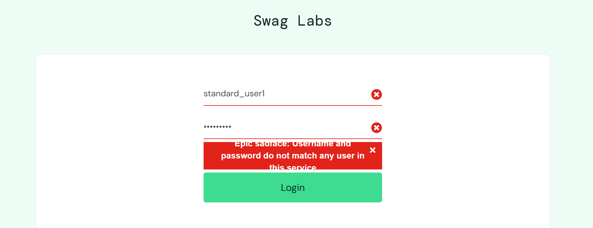

# Bug Reports - SauceDemo

| Field                  | Details                                                                                                                            |
| ---------------------- | ---------------------------------------------------------------------------------------------------------------------------------- |
| **Test Case**          | **TC-LOGIN-04**                                                                                                                    |
| **Title**              | UX Issue: Login Page – Error message is hard to read due to insufficient container space on invalid login                          |
| **Summary**            | When one or both fields contain invalid data, the error message becomes hard to read because the text collides with the container. |
| **Environment**        | Chrome / Windows / Desktop URL: (https://www.saucedemo.com) Automation: Playwright                                           |
| **Steps to Reproduce** | 1. Navigate to the login page 2. Fill the fields with invalid data 3. Click Login button                                     |
| **Expected Result**    | Error message should be readable and easy to understand                                                                            |
| **Actual Result**      | Error message is hard to read and might effect user experience negatively                                                          |
| **Severity**           | Minor                                                                                                                              |
| **Priority**           | Low                                                                                                                                |
| **Notes / References** |                                                                                          |

---

| Field                  | Details                                                                                                    |
| ---------------------- | ---------------------------------------------------------------------------------------------------------- |
| **Test Case**          | **TC-LOGIN-09**                                                                                            |
| **Title**              | UX Issue: Login Page - Only username error message is displayed when both fields are empty                 |
| **Summary**            | When both username and password are empty, only the username field shows an error message                  |
| **Environment**        | Chrome / Windows / Desktop URL: (https://www.saucedemo.com) Automation: Playwright                   |
| **Steps to Reproduce** | 1. Navigate to the login page 2. Leave both username and password fields empty 3. Click Login button |
| **Expected Result**    | Error message should indicate that **both username and password fields are empty**                         |
| **Actual Result**      | Error message indicates **only the username field is empty**                                               |
| **Severity**           | Minor                                                                                                      |
| **Priority**           | Low                                                                                                        |
| **Notes / References** |                                                                  |

---
